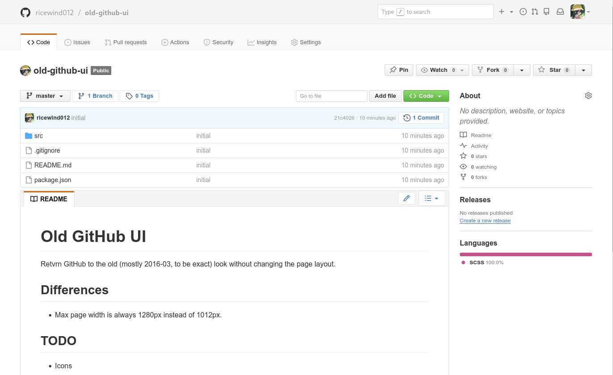

# Old GitHub UI

Retvrn GitHub to the old (mostly 2016-03, to be exact) look without changing the page layout.

## Installation

Install Stylus, then click [here](https://raw.githubusercontent.com/ricewind012/old-github-ui/refs/heads/dist/dist/old-github-ui.user.css).

## Differences

- Max page width is always 1280px instead of 1012px.

## TODO

- Icons
- Use primer vars everywhere
- Move Metadata/Filter/Search modules somewhere else, maybe common-components

## Credits

Most of the style has been stolen from [Primer 3.0.0](https://github.com/primer/css/tree/v3.0.0) and [Octicons 4.0.0](https://github.com/primer/octicons/tree/v4.0.0).
